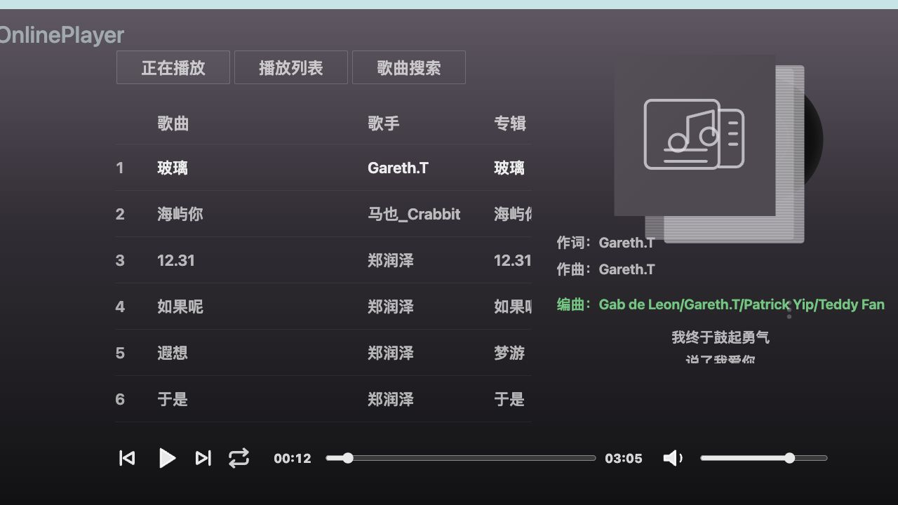

# Musical Garden Web Player

React and TypeScript web player for the Musical Garden personal music server. It includes a responsive music library, synchronized lyrics, playback queue, favorites, user administration, shared notes, client downloads, and PWA installation.



## Stack

- React 19
- TypeScript 5
- Vite 8
- Tiptap editor
- Caddy production image

## Run locally

```bash
npm ci
npm run dev
```

The development server runs at `http://localhost:5173` and proxies `/api` and `/healthz` to `127.0.0.1:9000`. Set `VITE_API_BASE_URL` when the API is hosted elsewhere.

## Validate and build

```bash
npm run typecheck
npm run build
```

## Related repositories

- [Server](https://github.com/musical-garden/musical-garden-server)
- [Android player](https://github.com/musical-garden/musical-garden-android-player)
- [Deployment](https://github.com/musical-garden/musical-garden-deployment)
